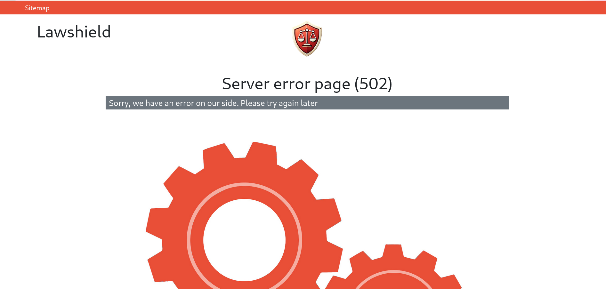

# Php-fpm service error

We can show nice [static html page](./../../../public/http/media/html/errors/server-error-502.html) when php-fpm service is down.

1. Bad answer example
2. Nice answer example
3. Nginx conf code

## 1. Bad answer example


## 2. Nice answer example



## 3. Nginx conf code

```nginx.conf  
    error_page 502 /50x.html;
    location = /50x.html {
        root html;
    }
```

See [nginx config example](./../../../nginx/simple.conf) for more information.
